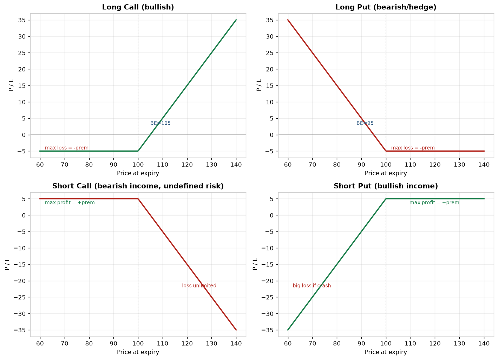
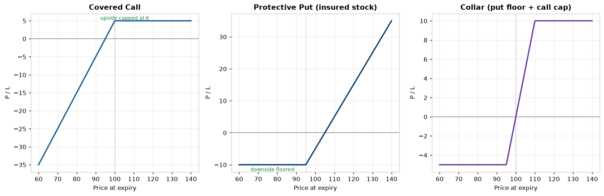
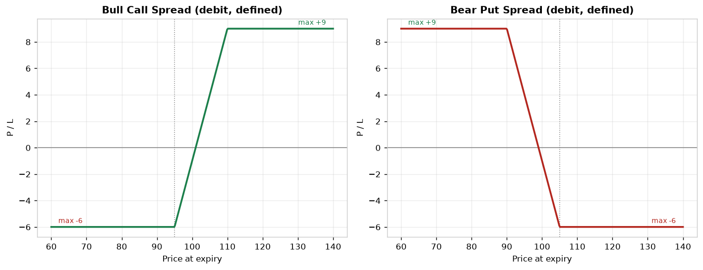
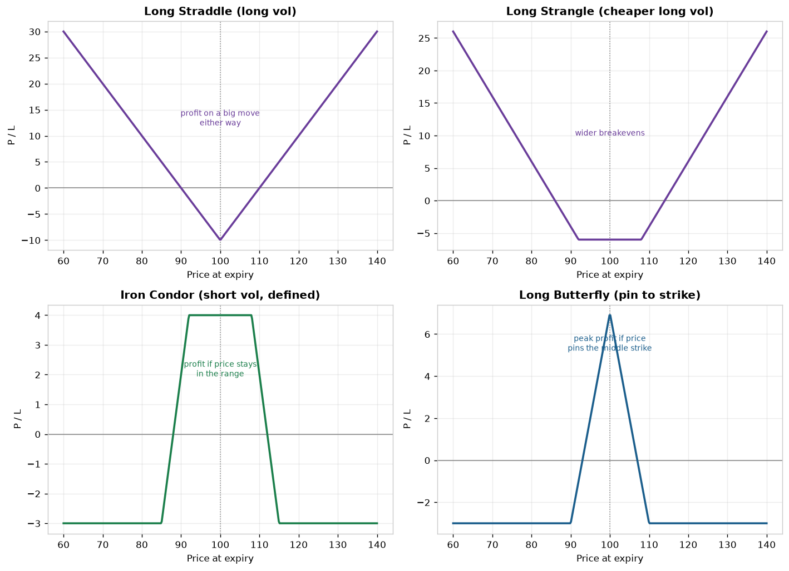
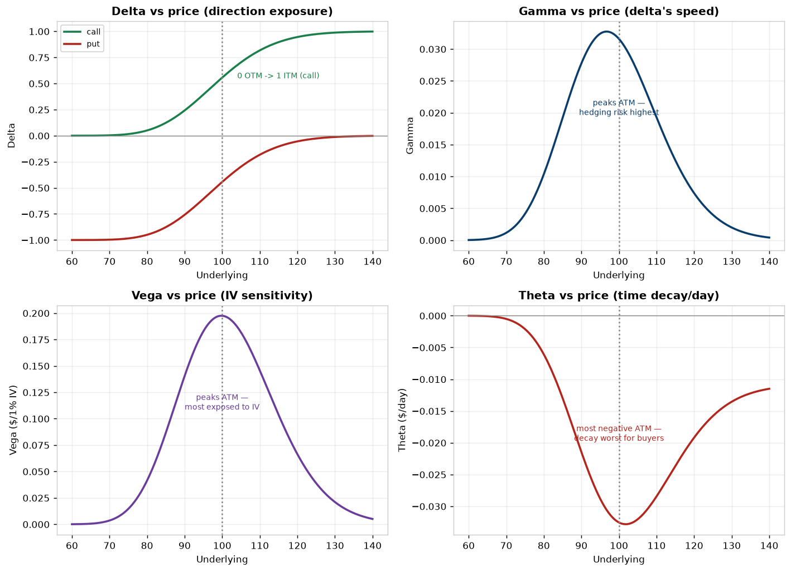
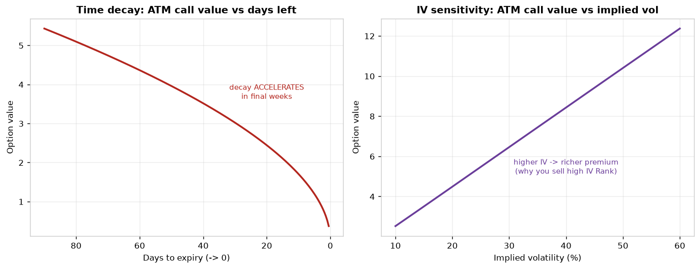

# Derivatives Examples Gallery — Strategies, Payoffs & Key Metrics

*A visual catalog for the Trader Screener project. Each example shows the core feature (the payoff shape) and the key metrics people read off it: **max profit, max loss, breakeven(s), dominant Greek exposure, and the IV signal to screen for.** The final two figures are the **Greeks** themselves — how delta/gamma/vega/theta behave, which is what professional options traders actually watch.*

*Charts generated by `_build_examples.py` (Black-Scholes for the Greeks). Illustrative params: strike K=100, premium ≈ $5, IV=25%, ~3 months to expiry. Shapes are exact; dollar values are examples.*

---

## How to read every options example
Five numbers describe almost any options position:
1. **Max profit** — the best outcome.
2. **Max loss** — the worst (is it *defined* or *unlimited*?).
3. **Breakeven(s)** — price(s) where P/L = 0.
4. **Direction (Delta)** — does it want the underlying up, down, or sideways?
5. **Volatility (Vega) + Time (Theta)** — does it *want* IV/time to rise or fall?

The recurring screen rule from the [signals doc](Derivatives_Types_and_Trading_Signals.md): **buy premium when IV Rank is low, sell premium when IV Rank is high.**

---

# 1. Single-leg positions — the building blocks

| Strategy | View | Max profit | Max loss | Breakeven | Greeks bias | Screen for |
|---|---|---|---|---|---|---|
| **Long call** | bullish | unlimited | premium (defined) | K + premium | +delta, +vega, −theta | low IV Rank (cheap) |
| **Long put** | bearish / hedge | large (→0) | premium (defined) | K − premium | −delta, +vega, −theta | low IV Rank, low skew |
| **Short call** | bearish/neutral income | premium (defined) | **unlimited** | K + premium | −delta, −vega, +theta | high IV Rank |
| **Short put** | bullish income | premium (defined) | large if crash | K − premium | +delta, −vega, +theta | high IV Rank |

> **Buyers** are long volatility and fight time decay; **sellers** collect time decay and are short volatility. Note the asymmetry: short call risk is *unlimited* — sizing matters.

---

# 2. Stock + option — hedged & income positions

| Strategy | Construction | Max profit | Max loss | Why use it | Screen for |
|---|---|---|---|---|---|
| **Covered call** | long stock + short call | capped at strike + premium | stock down to 0 (less premium) | income on a holding; mild bull/neutral | high IV Rank |
| **Protective put** | long stock + long put | unlimited (stock) | floored at put strike | insurance on a holding | low IV Rank (cheap insurance) |
| **Collar** | stock + long put + short call | capped (call strike) | floored (put strike) | low/zero-cost protection, range-bound | put skew rich vs call |

> A collar funds downside protection by selling away upside — a near-free hedge when put skew is rich.

---

# 3. Vertical spreads — defined risk *and* reward

| Strategy | View | Max profit | Max loss | Breakeven | Screen for |
|---|---|---|---|---|---|
| **Bull call spread** | moderately bullish | strike width − debit | debit paid | lower K + debit | high IV (caps vega cost vs lone call) |
| **Bear put spread** | moderately bearish | strike width − debit | debit paid | higher K − debit | high IV |

> Spreads trade away unlimited upside for a **lower cost and defined risk** — both legs cancel most of the vega, so they're the disciplined way to express direction when IV is elevated.

---

# 4. Volatility strategies — trading the *size* of the move, not direction

| Strategy | Bet | Max profit | Max loss | Greeks bias | Screen for |
|---|---|---|---|---|---|
| **Long straddle** | big move either way | large (both tails) | both premiums | +vega, −theta, ~0 delta | low IV Rank before a catalyst |
| **Long strangle** | big move, cheaper | large (both tails) | both premiums (less) | +vega, −theta | low IV Rank; wider breakevens |
| **Iron condor** | price stays in a range | net credit (defined) | width − credit (defined) | −vega, +theta | **high** IV Rank (sell rich premium) |
| **Long butterfly** | price pins a strike | width − debit | debit (defined) | −vega near center | pin/low-movement view |

> Straddles/strangles are **long volatility** (want IV/realized vol to rise — classic pre-earnings buy, but beware IV-crush after). Condors are **short volatility** (want quiet markets and high IV to fade). This is the purest expression of the IV-Rank rule.

---

# 5. The Greeks — what professionals actually watch

The Greeks measure how an option's value changes as price, volatility, and time move. **They are the risk dashboard** — a trader manages a book by its net Greeks, not by gut.

| Greek | Measures | Key behavior (shown) | Trader use |
|---|---|---|---|
| **Delta** | sensitivity to underlying price | call 0→1, put −1→0 across strikes; ≈0.5 ATM | net directional exposure / hedge ratio |
| **Gamma** | rate of change of delta | **peaks ATM**, near expiry | hedging risk; large near-expiry ATM gamma drives dealer flows (GEX) |
| **Vega** | sensitivity to IV | **peaks ATM**, grows with time to expiry | volatility exposure; long options = +vega |
| **Theta** | time decay per day | **most negative ATM**; worst for long options | premium sellers' tailwind, buyers' drag |

## Time decay & IV sensitivity over time

- **Left — time decay accelerates.** An ATM option loses value slowly far from expiry, then **decays fastest in the final weeks** (theta is non-linear). This is *why* sellers like short-dated options and buyers get hurt holding them.
- **Right — value rises with IV.** Higher implied vol → richer premium (vega at work). This is the mechanical reason to **sell when IV Rank is high and buy when it's low**.

---

# Summary: matching action to signal

| If you expect… | Action | Key Greek you're long/short | Screen signal |
|---|---|---|---|
| Up, leveraged | Long call / bull call spread | +delta | low IV Rank |
| Down / hedge | Long put / bear put spread / protective put | −delta | low IV Rank, low skew |
| Big move (any direction) | Long straddle / strangle | **+vega** | low IV Rank pre-catalyst |
| Quiet / range-bound | Iron condor / short put / covered call | **−vega, +theta** | **high IV Rank** |
| Pin a level | Long butterfly | −vega near center | low expected movement |

---

# What this means for the Trader Screener
- These payoffs are **derived from the same option-chain data** as the Part-2 signals — IV, IV Rank, skew, the Greeks. Surfacing them requires the 🔴 **options feed** (see [SCREENER_SHORTLIST.md §2h](../Project%20folder/SCREENER_SHORTLIST.md)).
- A trader-grade screener should let you **filter by Greek exposure and IV Rank**, then suggest which of these structures fits (the "matching action to signal" table is the logic).
- **Unusual options activity** in any of these structures = the options-side **smart-money** signal (ties to the equity congress/insider moat).

---

*Pair with: [Derivatives — Types & Signals](Derivatives_Types_and_Trading_Signals.md) (the metrics in depth) and [Trading and Exchanges summary](Trading_and_Exchanges_Harris_Summary.md) (why markets price them this way).*
