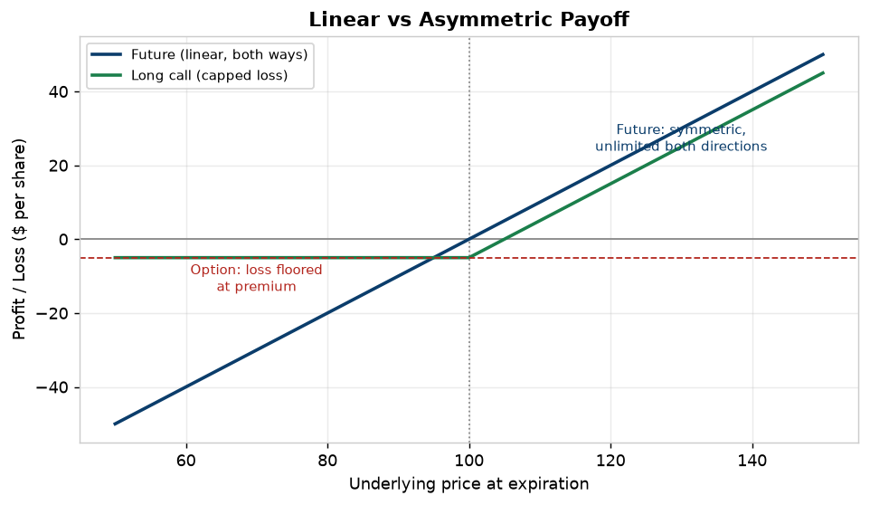
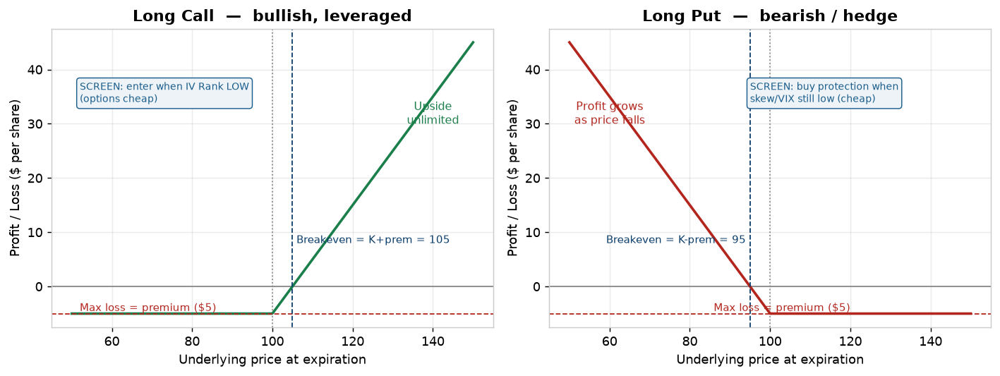
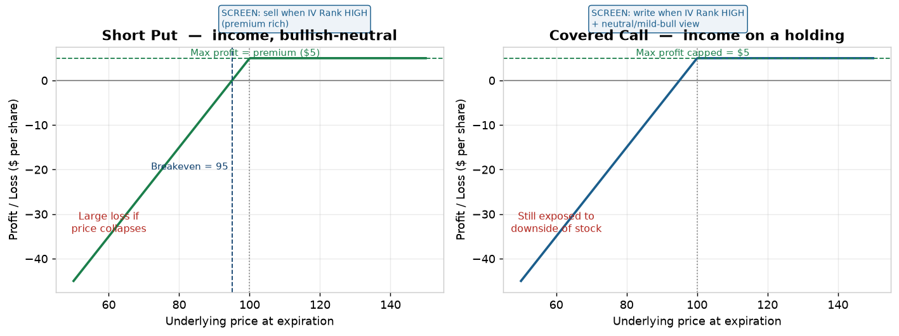
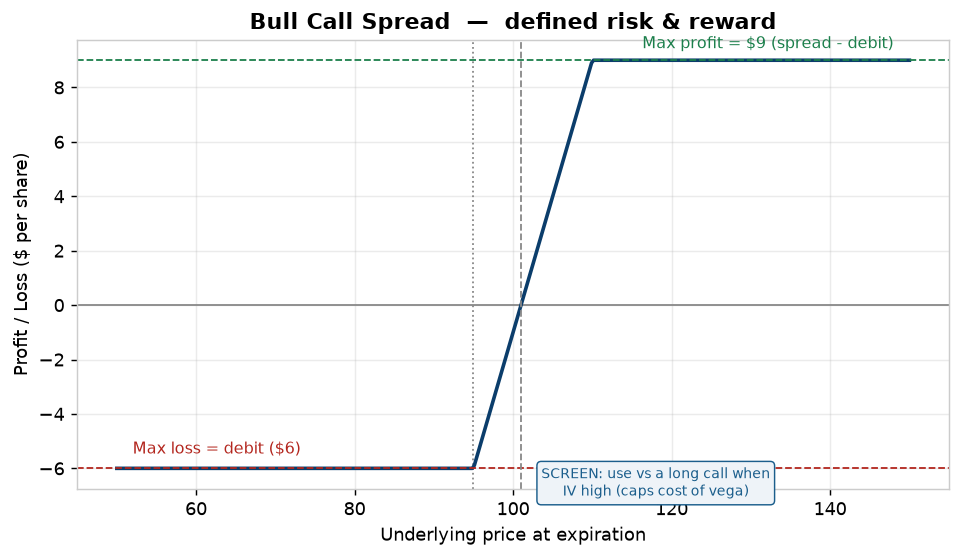
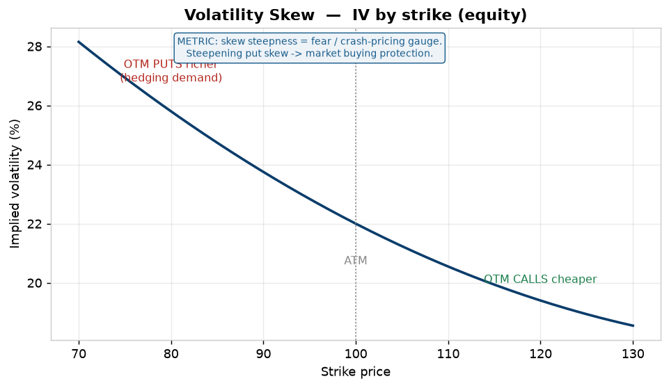
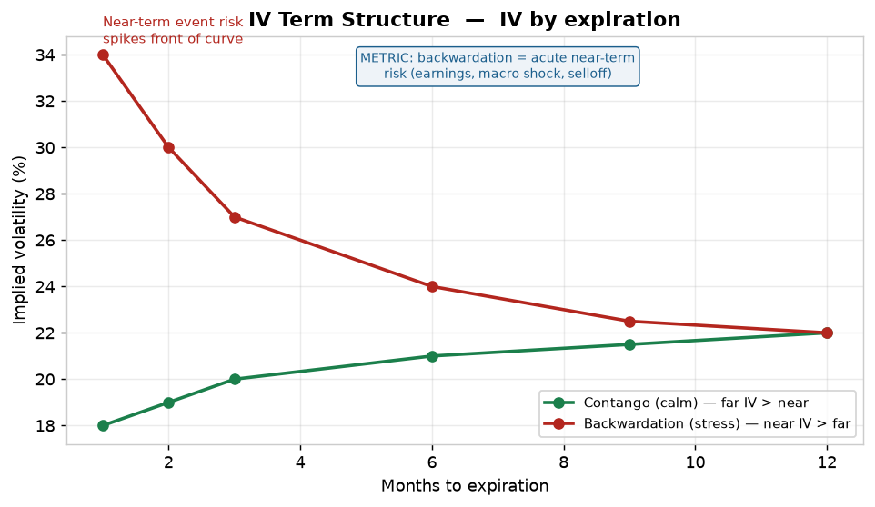

# Derivatives: Types & The Signals People Trade Off Them

*A study companion for the Trader Screener project. Two halves: (1) the full taxonomy of derivative instruments and why each exists, and (2) the signals traders actually watch to trade them — especially the options/volatility signals that have no equivalent in plain equity screening.*

*Compiled 2026-06-28. Anchored to exchange/regulator and reputable-broker sources (CME, Cboe, Schwab, Barchart, QuantInsti). Commercial tools are flagged; vet for bias.*

---

## What a derivative is
A **derivative** is a contract whose value *derives* from an underlying — a stock, index, rate, currency, or commodity. You never own the underlying; you own a contract referencing it. Derivatives exist to **transfer a specific risk** (price, rate, FX, volatility, time) without trading the underlying itself, usually with **leverage** (control a large notional for a small outlay).

The recurring "why trade it" answers reduce to three: **hedge** a real exposure, take **leveraged directional** risk, or harvest **income/risk premium** (e.g., selling option premium).

---

# PART 1 — THE TAXONOMY OF DERIVATIVES

## 1. Forwards
- **What:** a private, customized contract to buy/sell an asset at a set price on a future date. Traded **OTC** (over-the-counter), not on an exchange.
- **Key traits:** fully customizable (size, date, terms); **counterparty/credit risk** (no clearinghouse); no daily settlement.
- **Why trade:** bespoke hedging — a corporation locking an exact FX amount on an exact date.
- **Trade-off:** flexibility vs. illiquidity + credit risk.

## 2. Futures
- **What:** a **standardized, exchange-traded** forward. Fixed contract size, expiry, and terms; cleared by a central **clearinghouse**.
- **Key traits:** **margined and marked-to-market daily** (gains/losses settle each day); minimal counterparty risk; deep liquidity in major contracts.
- **Why trade:** leveraged directional exposure to commodities, rates, indices, FX, crypto; hedging real-world risk (farmer, airline, bond portfolio).
- **Sources:** [CME — Introduction to Futures](https://www.cmegroup.com/education/courses/introduction-to-futures), [CME Futures Fundamentals](https://www.cmegroup.com/company/futures-fundamentals.html).

## 3. Options
- **What:** the **right, not the obligation**, to buy (**call**) or sell (**put**) the underlying at a set **strike** price before/at **expiration**. Buyer pays a **premium**; seller (writer) collects it and takes on the obligation.
- **Key traits:** **asymmetric payoff** (buyer's loss capped at premium, upside open; seller's gain capped at premium, risk large); value driven by strike, time, and **volatility**.
- **Why trade:** leverage, **defined-risk** hedging (protective put), and **income** (selling premium). The richest signal set of any derivative — see Part 2.
- **Sources:** [CME — All About Options](https://www.cmegroup.com/education/courses/curriculum-all-about-options), [Cboe Options Institute](https://www.cboe.com/optionsinstitute/).

## 4. Swaps
- **What:** an agreement to **exchange streams of cash flows**. Most common: **interest-rate swaps** (fixed ↔ floating), **FX swaps**, **total-return swaps**, **credit default swaps (CDS)**.
- **Key traits:** mostly **OTC / institutional**; large notionals; used to convert the *character* of an exposure rather than bet on direction.
- **Why trade:** a firm with floating-rate debt swaps to fixed to remove rate risk; a fund gets index exposure via a total-return swap without holding the basket.
- **Note:** largely outside a retail screener's scope — included for completeness.

## 5. Where the lines blur (related instruments)
- **Options on futures** — an option whose underlying is a futures contract (common in commodities/rates). [CME course](https://www.cmegroup.com/education/courses/options-on-futures-for-equity-traders.html).
- **Warrants, convertible bonds** — embedded equity options.
- **Structured products / exotics** — barrier, Asian, digital options; bespoke payoffs (Hull's text is the reference for these).

### Quick comparison
| Type | Venue | Standardized? | Obligation? | Main use |
|---|---|---|---|---|
| Forward | OTC | No | Both sides obligated | Custom hedge |
| Future | Exchange | Yes | Both sides obligated | Leveraged directional / hedge |
| Option | Exchange/OTC | Yes (listed) | Buyer optional, seller obligated | Leverage, defined-risk hedge, income |
| Swap | OTC (some cleared) | No | Both sides obligated | Convert exposure (rate/FX/credit) |

### Linear vs asymmetric payoff
A future moves dollar-for-dollar both ways (symmetric); a long option floors the loss at the premium (asymmetric). This single difference is *why* options carry the volatility signals in Part 2 — their value depends on the *probability distribution* of the move, not just its direction.

---

# PART 1.5 — POTENTIAL ACTIONS: STRATEGY PAYOFFS & THE METRICS TO READ

Each chart shows the **profit/loss at expiration** for a common action, annotated with the three numbers you read off every payoff — **max loss, max profit, breakeven** — plus the **IV signal you'd screen for** before putting it on. (Strike K = 100, premium = $5 for illustration.)

## Directional / hedge — *buying* options (you pay premium, IV works against you)
- **Long call** — bullish; loss capped at premium, upside open. Best when options are **cheap** → screen for **low IV Rank**.
- **Long put** — bearish or portfolio hedge; loss capped at premium, profit grows as price falls. Buy protection *before* fear is priced in (skew/VIX still low).

## Income — *selling* options (you collect premium, IV works for you)
- **Short put** — bullish-neutral income; max profit = premium, but large loss if price collapses. Sell when premium is **rich** → screen for **high IV Rank**.
- **Covered call** — income on stock you own; caps upside at the strike in exchange for premium. Write when **IV Rank high** + a neutral/mild-bull view.

## Defined risk/reward — *spreads* (cap both sides, reduce vega)
- **Bull call spread** — buy a lower strike, sell a higher one. Both max loss (the debit) and max profit (strike width − debit) are fixed. Preferred over a lone long call when **IV is high**, because selling the upper strike offsets the rich premium.

> **The pattern:** *buy* options when IV Rank is **low** (cheap), *sell/spread* when IV Rank is **high** (rich). That single rule — read off the IV-Rank signal in Part 2 — drives which of these actions fits.

---

# PART 2 — THE SIGNALS PEOPLE TRADE OFF DERIVATIVES

Equity screening watches price, volume, fundamentals. **Derivatives — options especially — add a second dimension: volatility and positioning.** These signals have *no equivalent* in a plain stock screener, and they're the reason options data is a different (paid) feed.

## A. Implied Volatility (IV)
- **What:** the market's expectation of *future* movement, backed out of option prices. Higher IV → options more expensive → bigger move priced in.
- **Signal:** IV typically **rises into known events** (earnings, FDA, SEC filings, Fed) and **collapses after** ("IV crush"). 
- **How traded:** **sell** premium when IV is rich, **buy** when cheap — but always relative to the name's own history (see IV Rank).
- **Sources:** [Schwab — Using IV percentiles](https://www.schwab.com/learn/story/using-implied-volatility-percentiles), [AvaTrade — IV in options trading](https://www.avatrade.com/education/online-trading-strategies/implied-volatility-options-trading).

## B. IV Rank & IV Percentile
- **What:** normalizers that place *current* IV against its own **trailing 1-year** range.
  - **IV Rank** = position between the year's IV low and high (0–100).
  - **IV Percentile** = % of days in the past year IV was *lower* than today.
- **Why it matters:** raw IV is meaningless cross-name (a biotech's "normal" IV dwarfs a utility's). Rank/percentile answer **"is IV high *for this stock*?"** — the actual tradeable question.
- **Sources:** [Barchart — IV Rank/Percentile tool](https://www.barchart.com/options/iv-rank-percentile), [MarketChameleon — Volatility Rankings](https://marketchameleon.com/volReports/VolatilityRankings).

## C. Volatility Skew
- **What:** IV differs across **strikes** at the same expiry. Typically **OTM puts carry higher IV than OTM calls** — persistent demand for downside protection.
- **Signal:** the **shape/steepness** of skew measures fear and crash-pricing. Steepening put skew → rising demand for protection → market positioning defensively.
- **How traded:** skew informs which strikes to buy/sell (e.g., sell the rich OTM put, structure risk-reversals).
- **Sources:** [QuantInsti — Trading volatility skew](https://quantra.quantinsti.com/glossary/How-to-Trade-Options-Using-Volatility-Skew), [Strike — Volatility skew overview](https://www.strike.money/options/volatility-skew).

## D. Put/Call Ratio
- **What:** ratio of put to call activity (by volume or open interest), market-wide or per-name.
- **Signal:** a **sentiment gauge**. High = bearish/fearful, low = bullish/complacent. Often read **contrarian** at extremes (everyone hedged → little selling left).

## E. Open Interest (OI)
- **What:** total number of **outstanding** (not-yet-closed) contracts at a strike/expiry.
- **Signal:** large OI strikes act as **support/resistance magnets** (dealers hedging around them). Rising OI + rising price = conviction behind a move; falling OI = positions closing.

## F. Unusual Options Activity (UOA)
- **What:** option volume far exceeding its open interest, or large block sweeps — especially in OTM contracts.
- **Signal:** possible **informed positioning** ahead of a catalyst. Noisy, but a real flow signal.
- **Build tie-in:** this overlaps the project's **smart-money moat** — UOA is informed-flow detection in the options market, the same thesis as congress/insider tracking in equities.

## G. The Greeks (the risk dashboard)
| Greek | Measures | Trader use |
|---|---|---|
| **Delta** | sensitivity to underlying price | directional exposure / hedge ratio |
| **Gamma** | rate of change of delta | acceleration risk; dealer-hedging flows (GEX) |
| **Theta** | time decay per day | premium sellers' tailwind, buyers' drag |
| **Vega** | sensitivity to IV change | exposure to volatility itself |
| **Rho** | sensitivity to interest rates | minor for short-dated |

## H. Term Structure of Volatility
- **What:** IV plotted across **expirations** (near vs far).
- **Signal:** **contango** (far IV > near) is normal/calm; **backwardation** (near IV > far) signals acute near-term event risk or stress (e.g., VIX term structure inverting in a selloff).

## I. VIX & macro vol gauges
- **What:** Cboe's VIX = 30-day expected S&P volatility from option prices ("fear gauge").
- **Signal:** regime filter — spikes mark stress/capitulation; low, stable VIX marks complacency. Pairs with the project's FRED macro tab.

---

# WHAT THIS MEANS FOR THE TRADER SCREENER

- **New data dimension, new feed.** IV, skew, OI, Greeks, UOA require an **options-chain feed** (🔴 paid — e.g., Polygon, ORATS, CBOE DataShop, Tradier). Free yfinance won't cover them reliably. **Decide instrument coverage (shortlist §1) before building** — options support is a real cost commitment.
- **IV Rank/Percentile is the must-have normalizer** if you screen options at all — raw IV doesn't compare across names.
- **UOA = options-side smart money.** It's the same informed-flow thesis as the congress/insider moat; if options ship, surface UOA as a flagship signal.
- **Skew + term structure + VIX = regime context**, shared with the Research and macro tabs (collect once, serve both — per [ARCHITECTURE.md](../ARCHITECTURE.md)).
- **Signals → shortlist §2.** Add an options block to [SCREENER_SHORTLIST.md](../Project%20folder/SCREENER_SHORTLIST.md): IV, IV Rank, skew, put/call, OI, UOA, the Greeks — all 🔴.

---

## Sources
- [CME — All About Options](https://www.cmegroup.com/education/courses/curriculum-all-about-options)
- [CME — Introduction to Futures](https://www.cmegroup.com/education/courses/introduction-to-futures)
- [CME — Options on Futures for Equity Traders](https://www.cmegroup.com/education/courses/options-on-futures-for-equity-traders.html)
- [Cboe Options Institute](https://www.cboe.com/optionsinstitute/)
- [Schwab — Using Implied Volatility Percentiles](https://www.schwab.com/learn/story/using-implied-volatility-percentiles)
- [Barchart — IV Rank & Percentile](https://www.barchart.com/options/iv-rank-percentile)
- [MarketChameleon — Volatility Rankings](https://marketchameleon.com/volReports/VolatilityRankings)
- [QuantInsti — How to Trade Options Using Volatility Skew](https://quantra.quantinsti.com/glossary/How-to-Trade-Options-Using-Volatility-Skew)
- [Strike — Volatility Skew](https://www.strike.money/options/volatility-skew)
- [AvaTrade — Implied Volatility in Options Trading](https://www.avatrade.com/education/online-trading-strategies/implied-volatility-options-trading)

*\* Barchart, MarketChameleon, Strike, AvaTrade are commercial — useful and current; the exchange/Schwab/QuantInsti links are the durable anchors.*
