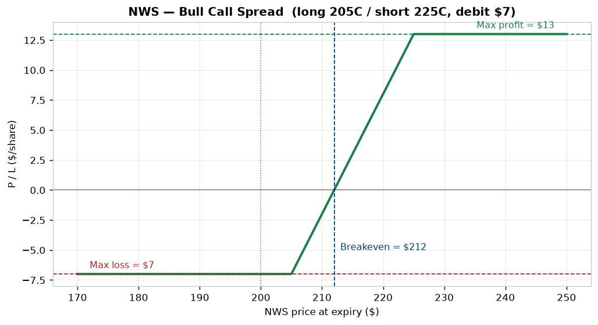
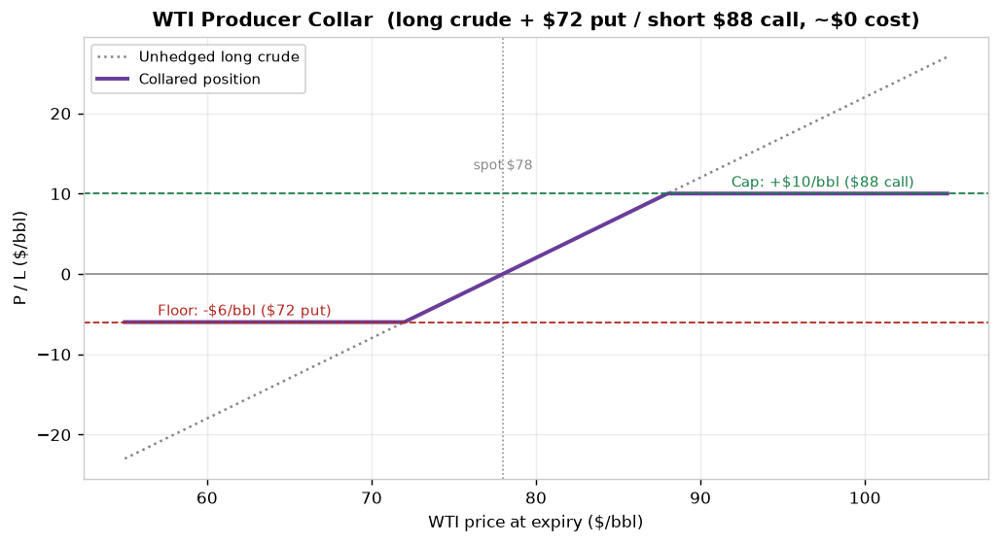
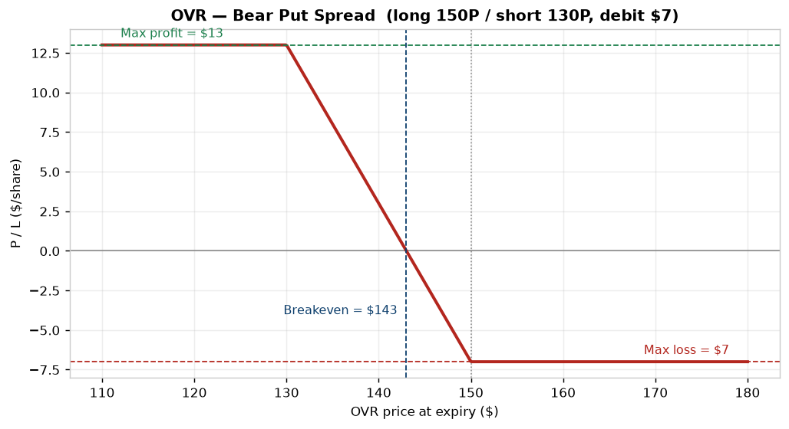
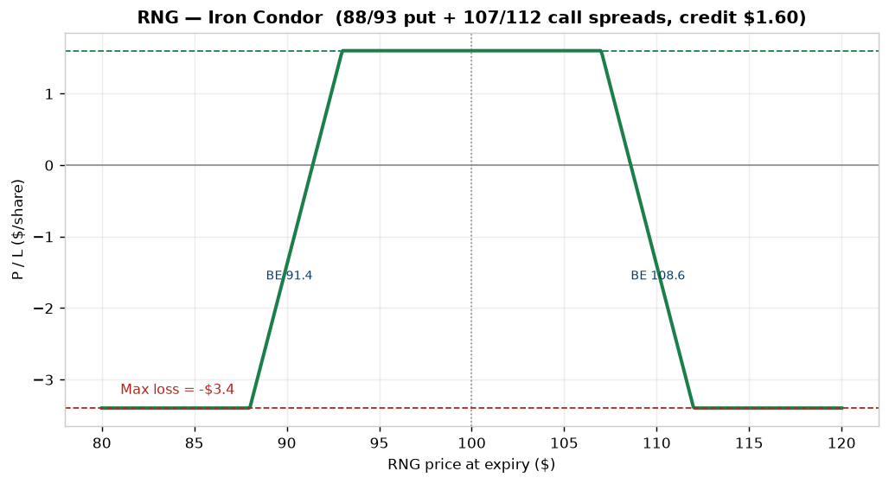
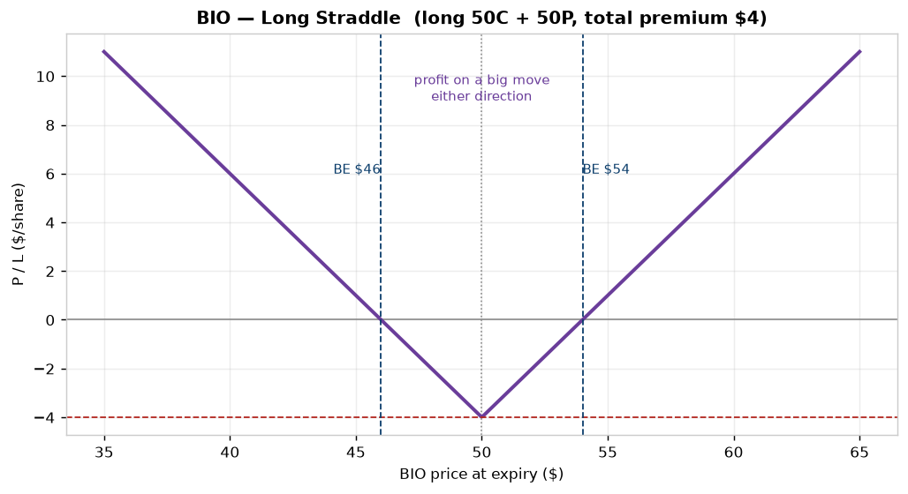
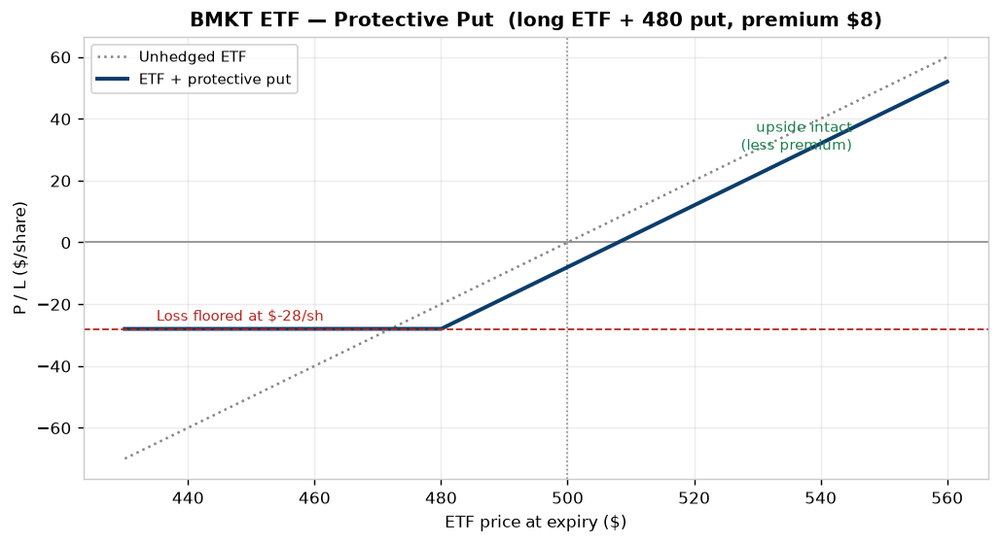

# Instrument Information Sheet (Tear Sheet) — Format & Examples

> **⚠️ EDUCATIONAL / ILLUSTRATIVE ONLY.** The instruments, figures, and recommendations below are **hypothetical**, built to mirror the *format* a research/trading desk uses. **Not investment advice.** No live data.

A **tear sheet** is the one-page brief a desk produces per instrument: the snapshot metrics, the view, the catalysts/risks, and — the part most retail tools omit — a **specific derivative recommendation** with strikes, cost, and payoff. This doc gives the **reusable template** plus two worked examples (an equity and a commodity). It doubles as the **target output spec** for the Trader Screener's per-instrument detail view.

---

## THE TEMPLATE (what every sheet contains)

```
┌─ HEADER ──────────────────────────────────────────────────────────┐
│ Name / Ticker · Asset class · Sector · Date · Analyst              │
│ RATING (Buy/Hold/Sell or Long/Neutral/Short) · 12-mo Price Target  │
├─ SNAPSHOT (the screen columns) ───────────────────────────────────┤
│ Price · Mkt cap/Notional · 52-wk range · Avg daily $ volume        │
│ Valuation: P/E, EV/EBITDA, upside-to-target                        │
│ Risk: beta, realized vol, ATR, max drawdown                        │
│ Options: IV, IV Rank/percentile, skew, put/call, term structure    │
├─ THESIS (the view) ───────────────────────────────────────────────┤
│ 2-4 sentences: direction, horizon, why now                         │
├─ CATALYSTS & RISKS ───────────────────────────────────────────────┤
│ Upcoming events (earnings, data, supply) · key downside risks      │
├─ POSITIONING / SMART MONEY ───────────────────────────────────────┤
│ Insider / congress / fund flows · unusual options activity         │
├─ TECHNICALS ──────────────────────────────────────────────────────┤
│ Trend, support/resistance, momentum (RSI/MA), relative strength    │
├─ DERIVATIVE RECOMMENDATION ───────────────────────────────────────┤
│ Structure · strikes/expiry · net cost · max profit/loss/breakeven  │
│ Rationale tied to IV Rank + thesis · payoff chart                  │
└─ DISCLAIMERS ─────────────────────────────────────────────────────┘
```

The discipline: **thesis → metrics that support it → a structure whose payoff matches the thesis *and* the volatility regime.** A bullish view in *high* IV is expressed differently (spread) than the same view in *low* IV (outright call).

---

# EXAMPLE 1 — EQUITY TEAR SHEET (hypothetical)

## Northwind Semiconductor — NWS · Equity · Semiconductors
**Date:** illustrative · **Rating: BUY** · **12-mo target: $240** (+20% vs $200 spot)

### Snapshot
| Metric | Value | Metric | Value |
|---|---|---|---|
| Price | $200 | Avg daily $ vol | $1.8B (deep) |
| Market cap | $310B | Beta | 1.35 |
| 52-wk range | $128 – $214 | Realized vol (30d) | 34% |
| Fwd P/E | 28× | ATR (14d) | $6.20 |
| EV/EBITDA | 19× | **IV / IV Rank** | **38% / 72** (elevated) |
| Upside to target | +20% | Skew | moderate put skew |

### Thesis
Structural AI-datacenter demand + a product cycle into next year. Momentum strong (above rising 50/200-day MAs, RS in top decile). **But IV Rank is high (72)** ahead of earnings — options are *rich*, so we want a structure that **doesn't overpay for volatility.**

### Catalysts & risks
- **Catalysts:** earnings (≈3 wks), product launch, sector capex guides.
- **Risks:** earnings IV-crush, China export policy, high valuation (28× fwd) → sharp drawdown if growth disappoints.

### Positioning / smart money
- Net **insider buying** last quarter (illustrative); two committee-linked congressional buys flagged.
- **Unusual options activity:** upside call sweeps in the front month.

### Technicals
- Uptrend; support $188 (50-day), resistance $214 (prior high); RSI 61 (room before overbought).

### ▶ Derivative recommendation — **Bull Call Spread**
**Long 205 call / short 225 call, ~3-month expiry · net debit $7/share.**

| Metric | Value |
|---|---|
| Max profit | **$13/share** (at ≥ $225) |
| Max loss | **$7/share** (debit, at ≤ $205) |
| Breakeven | **$212** |
| Greek bias | +delta, reduced vega (sells the rich upper strike) |

**Why this structure:** bullish thesis, but **IV Rank 72 makes a lone long call expensive** (you'd overpay vega and get crushed post-earnings). Selling the 225 call offsets premium and caps vega — express the upside view at defined, lower cost. If IV Rank were *low*, we'd prefer an outright call.



---

# EXAMPLE 2 — COMMODITY TEAR SHEET (hypothetical)

## WTI Crude Oil — CL futures · Commodity · Energy
**Date:** illustrative · **View: NEUTRAL-to-LONG, hedge downside** · **Use case: producer risk desk**

### Snapshot
| Metric | Value | Metric | Value |
|---|---|---|---|
| Spot | $78/bbl | Front-month OI | high / liquid |
| 52-wk range | $66 – $94 | Realized vol (30d) | 41% |
| Contango/backwardation | mild backwardation | **IV / IV Rank** | **44% / 65** |
| Roll yield | positive (backwardation) | Skew | call-side (supply risk) |

### Thesis
A producer is **long physical crude** and wants to **protect a budget floor** without selling all upside. Near-term **backwardation + elevated IV (Rank 65)** mean selling an upside call is well-paid — fund a downside put with it.

### Catalysts & risks
- **Catalysts:** OPEC+ meeting, inventory prints (EIA), geopolitics, demand data.
- **Risks:** demand shock (recession) → price collapse; supply shock → spike (caps capped upside).

### Positioning
- Managed-money net length elevated; commercial hedgers adding shorts (illustrative COT read).

### ▶ Derivative recommendation — **Costless Producer Collar**
**Long crude + buy $72 put / sell $88 call, ~3-month expiry · ≈ $0 net cost.**

| Metric | Value |
|---|---|
| Downside floor | **−$6/bbl** (protected below $72) |
| Upside cap | **+$10/bbl** (gives up gains above $88) |
| Net premium | ≈ $0 (call funds the put — works *because* IV/skew rich) |
| Effect | locks a $72–$88 realized band |

**Why this structure:** the producer needs **certainty, not speculation.** A collar floors the downside; selling the rich upside call (high IV Rank) pays for it, so protection is ~free. Trade-off: capped gains above $88. This is the **hedger** use-case from Harris's taxonomy — risk transfer, not a directional bet.



---

# EXAMPLE 3 — EQUITY, BEARISH (hypothetical)

## Overdrive Retail — OVR · Equity · Consumer Discretionary
**Date:** illustrative · **Rating: SELL** · **12-mo target: $125** (−17% vs $150 spot)

### Snapshot
| Metric | Value | Metric | Value |
|---|---|---|---|
| Price | $150 | Avg daily $ vol | $420M |
| Fwd P/E | 31× (vs peers 18×) | Beta | 1.1 |
| 52-wk range | $138 – $205 | Realized vol (30d) | 39% |
| Upside to target | −17% | **IV / IV Rank** | **47% / 80** (very rich) |

### Thesis
Margins compressing as discount peers take share; valuation still priced for growth. Price broke below the 200-day MA. **IV Rank 80** → puts are expensive, so a *lone* long put overpays vega → use a **spread**.

### Catalysts & risks
- **Catalysts:** holiday sales data, guidance cut risk at earnings.
- **Risks (to the short):** short squeeze (high short interest), a takeout bid, a dovish macro turn lifting all retail.

### ▶ Derivative recommendation — **Bear Put Spread**
**Long 150 put / short 130 put, ~3-month · net debit $7/share.**

| Metric | Value |
|---|---|
| Max profit | **$13/share** (at ≤ $130) |
| Max loss | **$7/share** (debit) |
| Breakeven | **$143** |
| Why | bearish in **high IV** → the short 130 put funds the long, caps vega cost vs a lone put |



---

# EXAMPLE 4 — EQUITY, RANGE-BOUND / INCOME (hypothetical)

## Rangebound Utilities — RNG · Equity · Utilities
**Date:** illustrative · **View: NEUTRAL (range $93–$107)** · **Goal: income**

### Snapshot
| Metric | Value | Metric | Value |
|---|---|---|---|
| Price | $100 | Beta | 0.45 (low) |
| 52-wk range | $88 – $112 | Realized vol (30d) | 16% (calm) |
| Dividend yield | 3.8% | **IV / IV Rank** | **24% / 78** (rich vs its own calm) |

### Thesis
Low-beta, rate-sensitive, **tends to mean-revert in a tight band**. No near-term catalyst. **IV Rank is high relative to its low realized vol** → option premium is overpriced for how little this name actually moves. **Sell** that premium, defined-risk.

### ▶ Derivative recommendation — **Iron Condor**
**Sell 93/107 strikes, buy 88/112 wings, ~6-week · net credit $1.60.**

| Metric | Value |
|---|---|
| Max profit | **+$1.60** (price stays $93–$107) |
| Max loss | **−$3.40** (wing width − credit) |
| Breakevens | **$91.40 / $108.60** |
| Greek bias | **−vega, +theta** — profits from time decay + falling IV |



---

# EXAMPLE 5 — EQUITY, EVENT / LONG VOLATILITY (hypothetical)

## Biocatalyst Therapeutics — BIO · Equity · Biotech
**Date:** illustrative · **View: BIG MOVE, direction unknown** · **Event: trial readout**

### Snapshot
| Metric | Value | Metric | Value |
|---|---|---|---|
| Price | $50 | Catalyst | Phase-3 readout (~4 wks) |
| 52-wk range | $22 – $78 | Realized vol (30d) | 55% (high, but...) |
| Binary outcome | yes | **IV / IV Rank** | **60% / 30** (low *for this name*) |

### Thesis
A trial readout is **binary** — the stock gaps up on success or craters on failure; direction is genuinely unknown. Crucially **IV Rank is only 30** — the market hasn't *yet* fully priced the event, so volatility is **cheap relative to the move coming.** Buy volatility, not direction.

### ▶ Derivative recommendation — **Long Straddle**
**Long 50 call + long 50 put, expiry after the readout · total premium $4.**

| Metric | Value |
|---|---|
| Max profit | large (either tail) |
| Max loss | **$4** (both premiums) |
| Breakevens | **$46 / $54** |
| Greek bias | **+vega, −theta** — wants the move *and* rising IV; hurt by delay |
| ⚠️ Risk | **IV crush** — if the event resolves mildly, IV collapses and both legs lose |



---

# EXAMPLE 6 — ETF / PORTFOLIO HEDGE (hypothetical)

## Broad-Market ETF — BMKT · Equity index ETF
**Date:** illustrative · **View: LONG-TERM HOLD, hedge a drawdown** · **Use: portfolio insurance**

### Snapshot
| Metric | Value | Metric | Value |
|---|---|---|---|
| Price | $500 | Holding | core long position |
| **IV / IV Rank** | **18% / 25** (low — cheap insurance) | Macro | election + rate uncertainty ahead |

### Thesis
Keep the long-term holding, but **near-term tail risk** is elevated and **IV Rank is low** → protection is *cheap right now*. Buy insurance before fear is priced in (Harris: hedge before the adverse-selection premium widens).

### ▶ Derivative recommendation — **Protective Put**
**Long ETF + buy 480 put, ~3-month · premium $8/share.**

| Metric | Value |
|---|---|
| Max profit | unlimited (the ETF's upside, less premium) |
| Max loss | **floored at −$28/share** (below $480) |
| Cost of insurance | $8/share (≈1.6%) |
| Why now | **low IV Rank = cheap puts**; defined, known downside |



---

## The six examples in one table
| # | Instrument | View | IV Rank | Structure | Why that structure |
|---|---|---|---|---|---|
| 1 | NWS (equity) | Bullish | 72 (high) | Bull call spread | bullish but IV rich → cap vega cost |
| 2 | WTI (commodity) | Hedge long | 65 (high) | Costless collar | sell rich call to fund put floor |
| 3 | OVR (equity) | Bearish | 80 (high) | Bear put spread | bearish in high IV → spread not lone put |
| 4 | RNG (equity) | Neutral/range | 78 (high) | Iron condor | sell overpriced premium, defined risk |
| 5 | BIO (equity) | Big move, unknown dir | 30 (low) | Long straddle | buy cheap vol before a binary event |
| 6 | BMKT (ETF) | Hold + hedge | 25 (low) | Protective put | cheap insurance, low IV Rank |

> **The through-line:** the **view sets the delta** (up/down/neutral/move), the **IV Rank sets the structure** (buy premium when low, sell/spread when high). Same rule, six situations.

---

# WHY THIS IS THE SCREENER'S TARGET OUTPUT
This tear sheet is essentially **what the Trader Screener's per-instrument detail view should generate.** Every block maps to data the project already has or plans to collect:

| Tear-sheet block | Screener data source |
|---|---|
| Snapshot valuation/fundamentals | `fundamentals.json`, `model.json` (✅ have) |
| Liquidity / ADV / beta / ATR | OHLCV-derived (🟡 free yfinance) |
| Options: IV, IV Rank, skew, term | options-chain feed (🔴 paid — shortlist §2h) |
| Positioning / smart money | congress + insider + UOA (✅ equity moat) |
| Technicals | OHLCV-derived (🟡) |
| **Derivative recommendation** | rules engine: thesis (score/momentum) × IV Rank → structure |

**The recommendation logic = the "matching action to signal" table** from the [Examples Gallery](Derivatives_Examples_Gallery.md): bullish + low IV → long call; bullish + high IV → call spread; hedge + rich skew → collar; range + high IV → condor. A screener that fuses your **smart-money moat** with **IV-regime-aware structure selection** is the differentiated, firm-grade output — exactly the legitimacy gap discussed for the project.

---

*Related: [Derivatives — Types & Signals](Derivatives_Types_and_Trading_Signals.md) · [Examples Gallery](Derivatives_Examples_Gallery.md) · [Screener Shortlist](../Project%20folder/SCREENER_SHORTLIST.md). All figures herein are hypothetical and for education only.*
